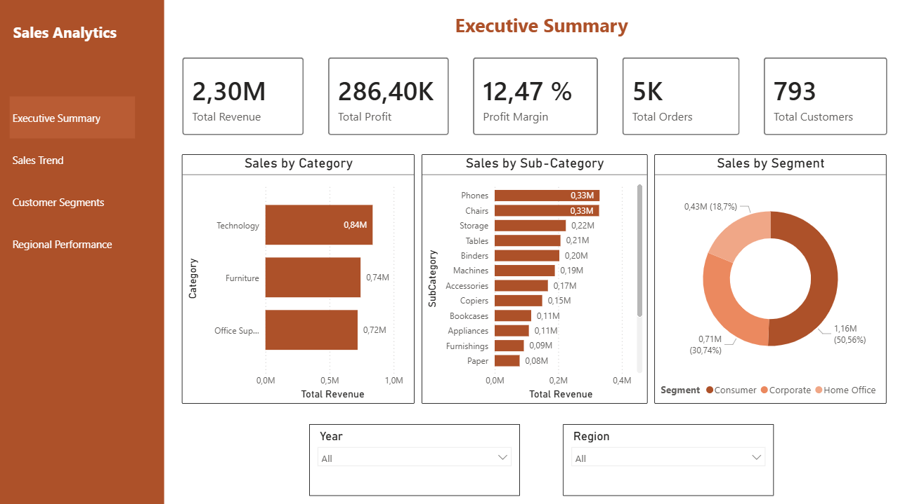
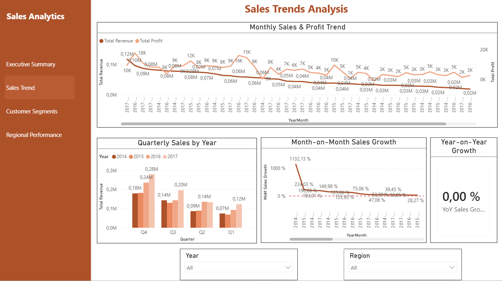
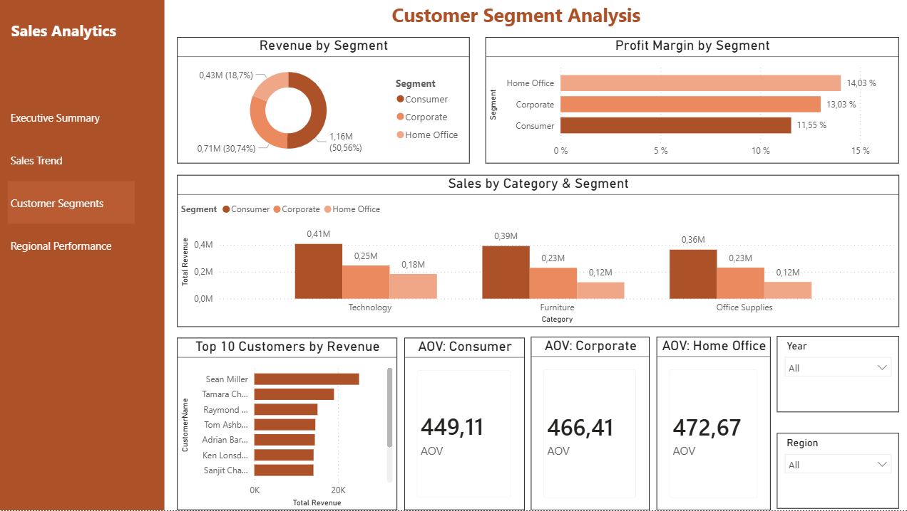
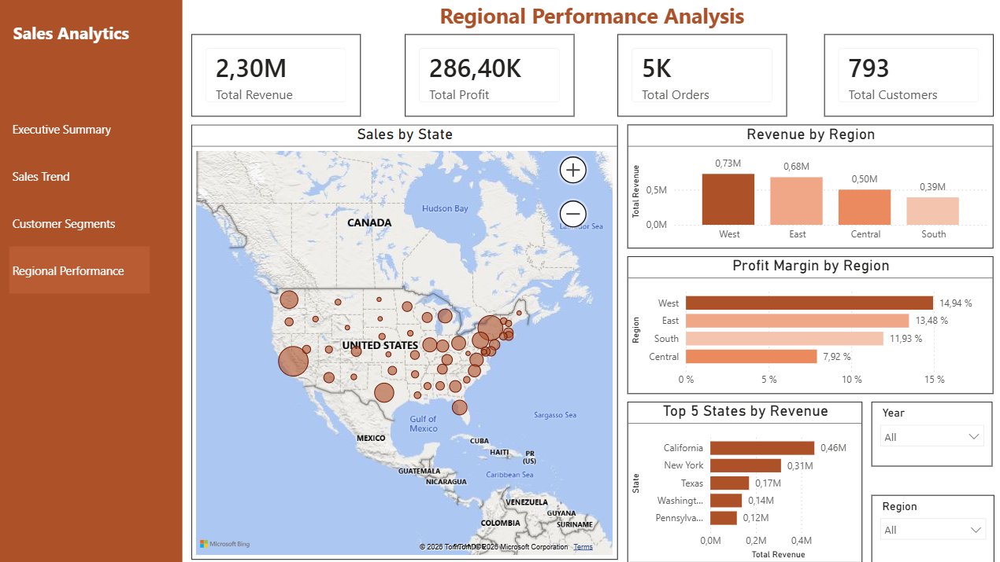
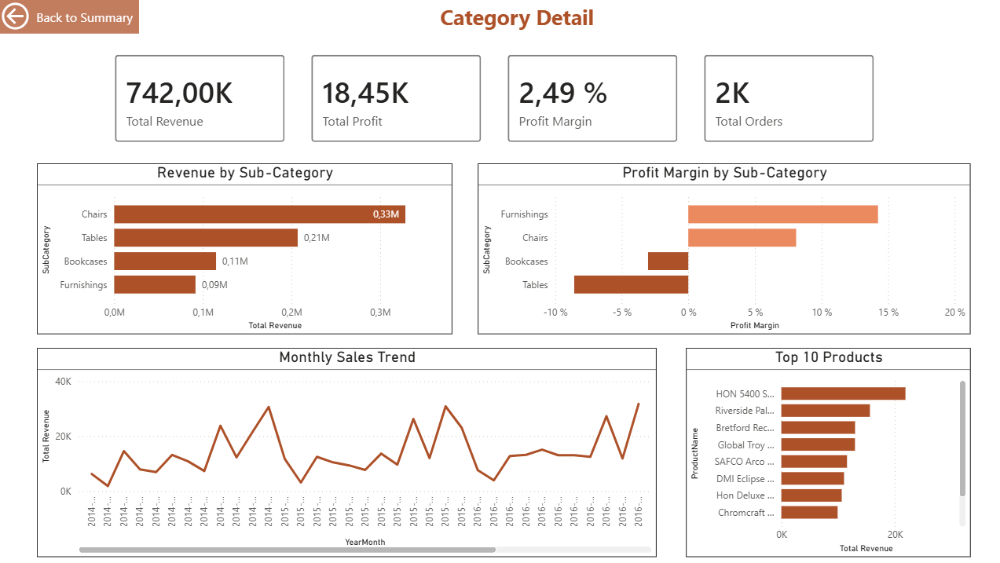

# Customer Sales Analytics Dashboard

A Power BI dashboard built to explore sales performance, customer behaviour, and regional trends using the Kaggle Superstore dataset (~10,000 orders, 2014–2017).

---

## What it covers

The dashboard has five pages:

**Executive Summary** — top-level KPIs (revenue, profit, margin, orders, customers) with sales broken down by category, sub-category, and customer segment.

**Sales Trends** — monthly and quarterly revenue trends, month-on-month growth, and year-on-year comparison across 2014–2017.

**Customer Segments** — revenue and profit margin split across Consumer, Corporate, and Home Office segments, top 10 customers, and average order value per segment.

**Regional Performance** — bubble map showing sales by US state, with revenue and margin comparison across the four regions.

**Category Detail** — a drill-through page accessible from the Executive Summary. Shows sub-category breakdown, profit margins, monthly trend, and top products for any selected category.

---

## Built with

- Power BI Desktop (data modelling, DAX, report design)
- Power Query — data cleaning and transformation
- DAX — custom measures including MoM and YoY time intelligence
- Star schema with a custom date table

---

## Files

- `Customer_Sales_Analytics_Dashboard.pbix` — open in Power BI Desktop
- `Customer_Sales_Analytics_Dashboard.pdf` — static export
- `data/Sample - Superstore.csv` — source dataset

---

## Screenshots

### Executive Summary

### Sales Trends

### Customer Segments

### Regional Performance

### Category Detail

---

**Sara Azmin** — [GitHub](https://github.com/SaraAzmin) | [LinkedIn](https://linkedin.com/in/your-profile)
